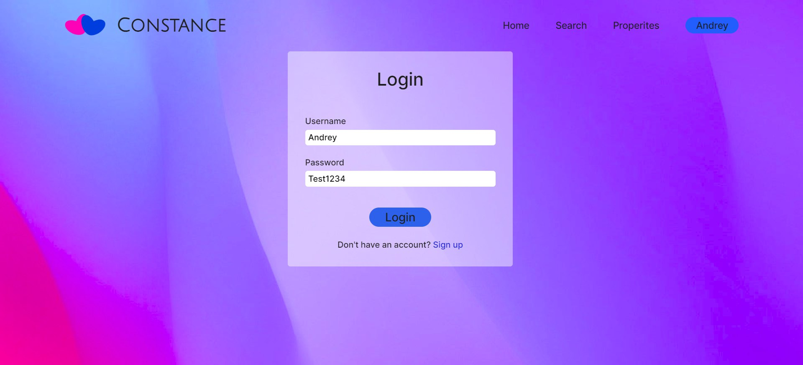
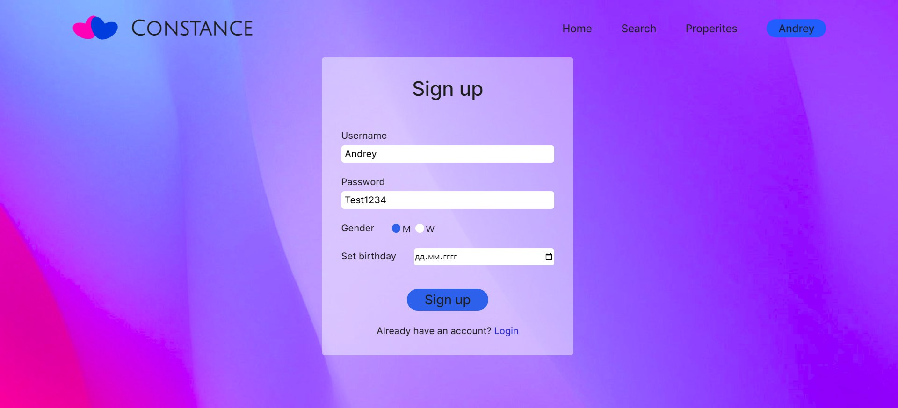
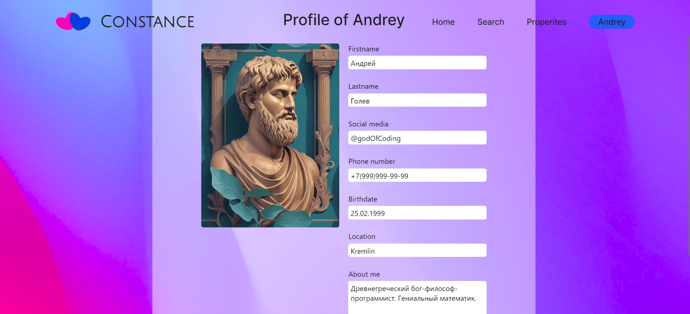
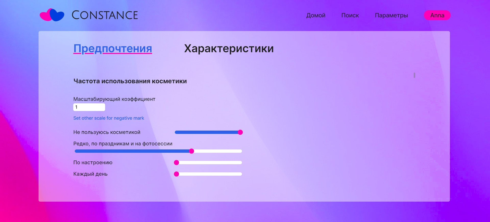
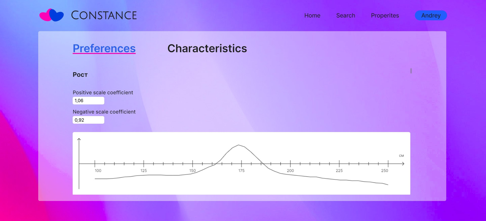
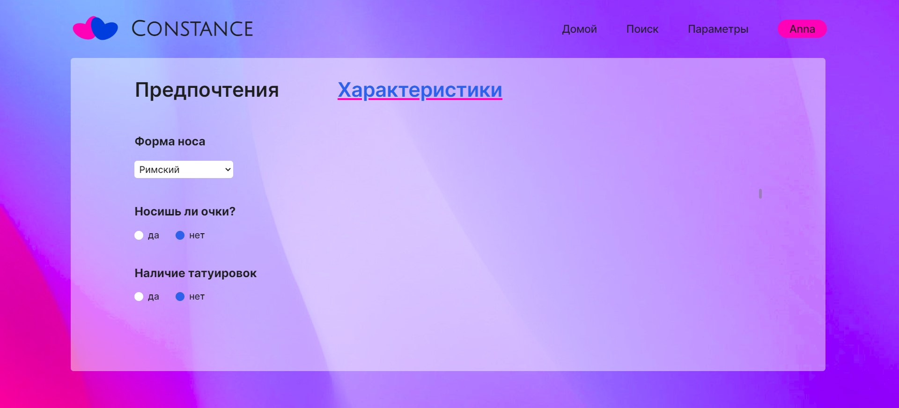
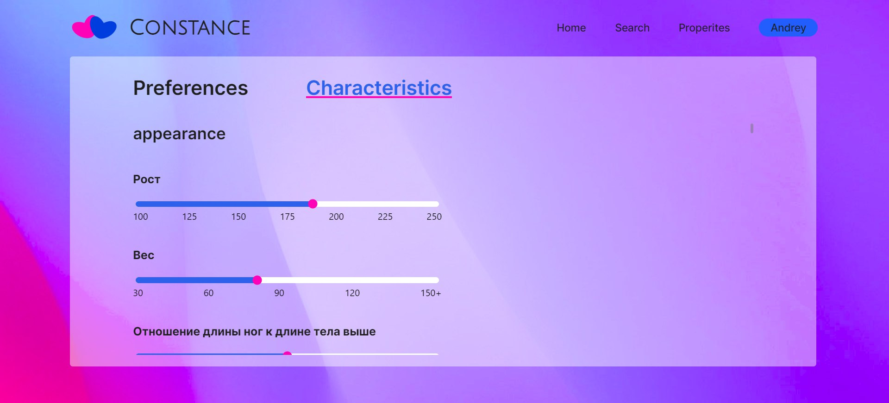
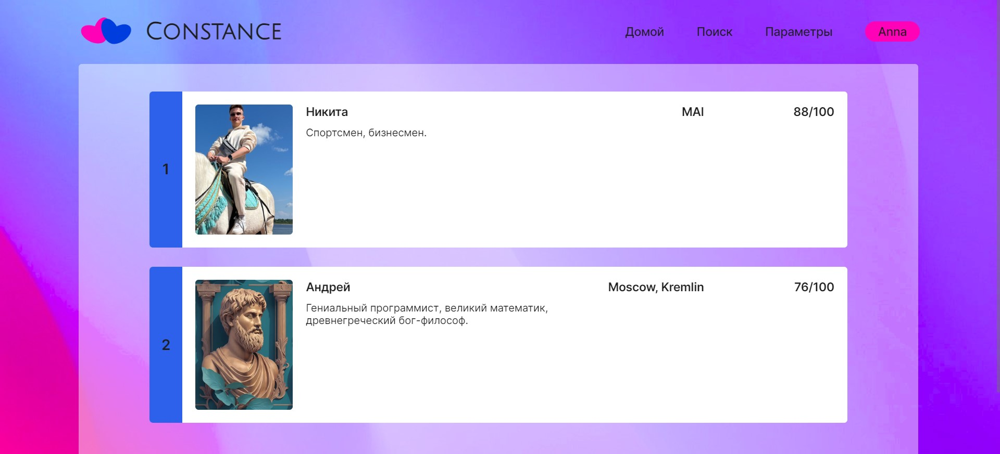

# Constance
## Описание проекта
Данный проект разрабатывается студентами 8-о института МАИ. 

**Тема**: Создание приложения для знакомств.

**Цель**: Разработка приложения для знакомств с поиском людей, основанном на характеристиках и предпочтениях пользователей и корреляции между ними.

**Основные задачи**: 
1. Разработка мат. модели описания предпочтений и характеристик.
2. Разработка алгоритма поиска.
3. Выбор и классификация признаков, учитываемых при поиске.
4. Определение структуры приложения.
5. Создание дизайна.
6. Проектирование и разработка базы данных. 
7. Реализация алгоритма поиска.
8. Разработка серверной части.
9. Верстка дизайна, разработка клиентской части.

Особенностью разрабатываемого приложения является продвинутая система поиска пар, основанная на математической модели 
предпочтений пользователя. Модель описывает предпочтения пользователя в виде совокупности признаков, которые делятся на 3 типа:
- Бинарный.
- Дискретный.
- Непрерывный.

Влияние каждого признака определяется парой коэффициентов для положительного и отрицательного значения. Дискретный признак 
описывается набором коэффициентов, указывающих приоритет значений внутри признака. Непрерывный признак описывается 
распределением приоритета по диапазону значения.

Задание характеристик и предпочтений производится при помощи интуитивно понятного интерфейса. 

Зная предпочтения пользователя *A* и характеристики пользователя *B* модель позволяет определить в виде коэффициента уровень 
вхождения *B* в предпочтения *A*. 

По уровню вхождения *A* в предпочтения *B* и уровню вхождения *B* в предпочтения *A* поиск формирует счет пары и 
позволяет пользователю получить рейтинг пар с лучшим обоюдным счетом. После чего пользователь может получить доступ к 
контактным данным другого для начала общения.

## Ссылки на ресурсы проекта:
- Miro: https://miro.com/app/board/uXjVNlSB3Yg=/?share_link_id=37131320093
- Notion: https://nimble-herring-864.notion.site/a0e25bbe093642eaa97ca4d380071ce4?v=c717519dbab84f24a8302c974d4e2f98

## Инструкция по запуску:
1. git clone ...
2. poetry install
3. В папку server добавить конфигурационные файлы:
- keys.cfg - файл с ключем шифрования для jwt токенов. Вид
```
[Settings_of_keys]
jwt_key = JWT_KEY
```
- for_bd.cfg - файл с данными для подключения к базе PostgreSQL. Вид:
```
[Settings_of_bd]
dbname = DB_NAME
user = NAME
password = PASSWORD
host = HOST_NAME
```
4. cd server
5. python initializator_for_db_devel.py - создаст необходимые таблицы в базе PostgreSQL.
6. python main.py - запуск приложения. Ключ -d - запуск в режиме отладки.

## Экраны приложения

Домашняя страница:


Вход:



Регистрация:



Профиль пользователя:



Настройка бинарных предпочтений:


Настройка дискретного предпочтения:



Настройка непрерывного предпочтения:



Настройка бинарных характеристик:



Настройка дискретных характеристик:


Настройка непрерывных характеристик:



Поиск:

